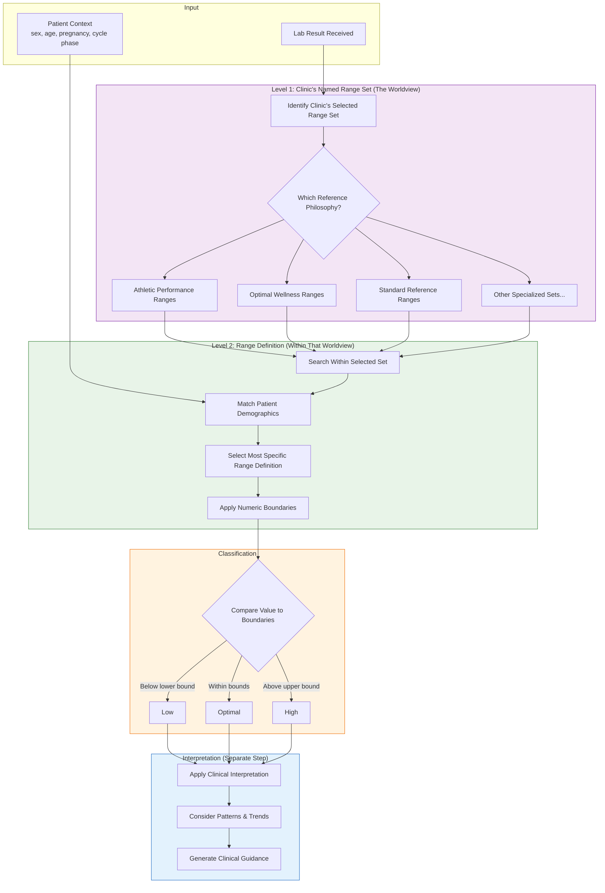

# How Named Range Sets Work
{: .no_toc }

A clear explanation of how the system selects and applies numeric reference ranges to your patients' lab results.
{: .fs-6 .fw-300 }

## Table of contents
{: .no_toc .text-delta }

1. TOC
{:toc}

---

## Plain-Language Overview

### What is a Named Range Set?

A **Named Range Set** is a curated reference framework that represents a clinical philosophy or "worldview" for evaluating lab results. When your clinic sets up HealthPlus, you select which Named Range Set to use as your default — this is a foundational choice that shapes how all patient results are evaluated.

Think of it as choosing which textbook your clinic uses. An integrative medicine clinic might select "Optimal Wellness Ranges" with tighter thresholds. A sports medicine clinic might select "Athletic Performance Ranges" with values calibrated for trained athletes. A conventional practice might select "Standard Reference Ranges" aligned with traditional laboratory intervals.

**Each Named Range Set contains a complete library of range definitions** covering hundreds of analytes, with variations for different demographics (sex, age, pregnancy, cycle phase). When you select a Named Range Set, you're adopting that entire reference library as your clinic's baseline.

### Two Levels of Range Selection

There are two distinct levels to understand:

| Level | What It Is | Who Decides | Example |
|:------|:-----------|:------------|:--------|
| **Named Range Set** | The clinic's chosen reference framework ("worldview") | Clinic administrator at setup | "Athletic Performance Ranges" |
| **Range Definition** | A specific range within that set for a given context | System selects automatically | TSH for male athletes age 25-40 |

**First**, your clinic chooses its Named Range Set — this is your practice's reference philosophy.

**Then**, for each patient result, the system finds the most appropriate range definition *within* that set based on the patient's demographics.

### Why Different Clinics Need Different Worldviews

Different clinical contexts have fundamentally different baselines:

| Clinic Type | Might Select | Why |
|:------------|:-------------|:----|
| **Sports Medicine** | Athletic Performance Ranges | Athletes have different "normal" values for hemoglobin, testosterone, ferritin, etc. |
| **Functional Medicine** | Optimal Wellness Ranges | Tighter ranges focused on optimal function, not just disease absence |
| **Fertility Clinic** | Reproductive Health Ranges | Specialized ranges for hormones with cycle-phase precision |
| **Conventional Practice** | Standard Reference Ranges | Traditional lab reference intervals |
| **Pediatric Practice** | Pediatric Reference Ranges | Age-appropriate ranges for children and adolescents |

A hemoglobin of 17.5 g/dL might be flagged as "High" in a conventional range set but "Optimal" in an athletic range set. The Named Range Set determines which lens is applied.

### The Key Distinction: Ranges vs. Interpretation

It is important to understand two separate steps:

| Step | What It Does | Example |
|:-----|:-------------|:--------|
| **Range Selection** | Determines the numeric boundaries based on clinic worldview + patient context | TSH: 0.5 – 2.0 mIU/L |
| **Interpretation** | Explains what the result means clinically | "Suggests optimal thyroid function" |

**Analogy**: Choosing a Named Range Set is like choosing which rulebook to use before scoring a test. An athletic league uses different scoring criteria than a recreational league. Once you've chosen the rulebook, the system finds the right page (range definition) for your specific player (patient). Interpretation is like writing the report card that explains what the score means.

{: .important }
> Numeric ranges determine classification (low/optimal/high). Interpretation explains clinical meaning. These are separate steps.

---

## What Determines Which Range Set Is Used

Range selection is based **only on stable clinical context** — factors that are objective and verifiable at the time of specimen collection.

### Factors That Affect Range Selection

- **Specimen type** (e.g., serum, plasma, whole blood)
- **Biological sex** (when ranges differ by sex)
- **Age** (when age-stratified ranges exist)
- **Pregnancy status** and trimester
- **Menstrual cycle phase** (for cycle-dependent hormones like progesterone)

### Factors That Do NOT Affect Range Selection

- Current symptoms
- Diagnoses
- Medications
- Treatment goals
- Patient preferences
- Clinical suspicion

{: .warning }
> **Symptoms do not change the numeric ranges.**
>
> If a patient reports fatigue, their TSH reference range remains the same. The interpretation may discuss fatigue in context, but the numeric boundaries that define "low" or "high" do not shift based on symptoms.

This separation ensures that range selection is reproducible, auditable, and not influenced by subjective factors.

---

## Step-by-Step: What Happens When a Lab Is Uploaded

When a new lab result enters the system, the following steps occur:

### Step 1: Lab Result Received

The system receives the numeric value, analyte code, and specimen information from the lab interface or manual entry.

### Step 2: Clinic's Named Range Set Identified (The Worldview)

The system identifies which Named Range Set your clinic has selected as its default. This is the foundational "worldview" — the entire reference philosophy your clinic has adopted.

For example:
- A sports medicine clinic using "Athletic Performance Ranges"
- A functional medicine clinic using "Optimal Wellness Ranges"
- A conventional clinic using "Standard Reference Ranges"

This step determines **which library of ranges** to search within.

### Step 3: Context-Specific Range Definition Selected (Within That Worldview)

Within the clinic's Named Range Set, the system finds the most appropriate range definition based on the patient's demographics:

- If the patient is a 35-year-old pregnant woman in her second trimester, the system looks for a range specific to "female, pregnant, trimester 2" *within the clinic's selected range set*
- If no trimester-specific range exists in that set, it uses the general pregnancy range from that set
- If no pregnancy range exists in that set, it uses the standard female range from that set

The system always selects the **most specific match** available *within the clinic's chosen worldview*.

{: .note }
> The clinic's Named Range Set is the "which textbook" decision. The range definition is the "which page" decision. Both matter.

### Step 4: Value Classified

The numeric value is compared against the selected range boundaries:

| Classification | Meaning |
|:---------------|:--------|
| **Critical Low** | Far below the lower bound |
| **Low** | Below the lower bound |
| **Suboptimal Low** | Within range but approaching lower bound |
| **Optimal** | Well within the reference range |
| **Suboptimal High** | Within range but approaching upper bound |
| **High** | Above the upper bound |
| **Critical High** | Far above the upper bound |

### Step 5: Interpretation Overlays Applied (Separately)

After classification, the system may apply interpretation guidance. This step is **separate** from range selection and may consider additional clinical context, patterns across multiple markers, or temporal trends.

{: .note }
> The numeric boundaries come from the range definition within the clinic's Named Range Set. Interpretation is layered on afterward and does not change those boundaries.

---

## Visual Explanation

The following diagram shows how a lab result flows through the two-tier range selection process and interpretation:

**Key Points:**
- **Purple box (Level 1)**: The clinic's Named Range Set — the foundational "worldview" chosen at clinic setup
- **Green box (Level 2)**: The specific range definition selected *within* that worldview based on patient demographics
- **Orange box**: Classification — comparing the value against the selected boundaries
- **Blue box**: Interpretation — a separate step that does not change the numeric boundaries

The same patient result can receive different classifications depending on which Named Range Set the clinic uses. A hemoglobin of 17.2 g/dL might be:
- **Optimal** in "Athletic Performance Ranges"
- **High** in "Standard Reference Ranges"

---

## Clinical Scenarios

The following scenarios illustrate how the two-tier range selection works in practice.

### Scenario 1: How Clinic Worldview Changes Everything

This scenario shows the same patient evaluated by two different clinics with different Named Range Sets.

**Patient Context:**
- 28-year-old male
- Competitive endurance athlete
- Routine performance panel

**Lab Result:** Hemoglobin = 17.2 g/dL

---

**Clinic A: Sports Medicine Practice**
- **Named Range Set (Worldview):** "Athletic Performance Ranges"
- **Range Definition Selected:** Male endurance athletes, age 18-35
- **Boundaries:** 16.0 – 18.5 g/dL
- **Classification:** **Optimal**

---

**Clinic B: Conventional Primary Care**
- **Named Range Set (Worldview):** "Standard Reference Ranges"
- **Range Definition Selected:** Adult males
- **Boundaries:** 13.5 – 17.0 g/dL
- **Classification:** **High**

---

**Why the Difference?**
The clinic's choice of Named Range Set (their worldview) fundamentally changes what "normal" means. Athletic populations have physiologically different baselines. Neither clinic is wrong — they're using reference frameworks appropriate to their patient population.

{: .important }
> The same lab value can be "Optimal" or "High" depending on which Named Range Set the clinic has selected. This is by design.

---

### Scenario 2: Standard Adult Female (Within a Single Worldview)

**Patient Context:**
- 42-year-old female
- Not pregnant
- Routine wellness panel

**Lab Result:** TSH = 1.8 mIU/L

**Range Selection Process:**
1. **Level 1 (Worldview):** Clinic uses "Optimal Wellness Ranges" as their Named Range Set
2. **Level 2 (Definition):** System searches within that set for: female, age 40-49, not pregnant
3. Finds range definition: TSH 0.5 – 2.5 mIU/L for adult females
4. Value 1.8 falls within bounds → **Optimal**

**What Does NOT Change the Range:**
- Patient reports fatigue → range stays 0.5 – 2.5
- Patient has family history of thyroid disease → range stays 0.5 – 2.5
- Clinician suspects subclinical hypothyroidism → range stays 0.5 – 2.5

**Interpretation Layer:**
The interpretation may note: "TSH is within the optimal functional range. If symptoms persist, consider evaluating Free T3 and T4."

{: .highlight }
> The numeric range does not change because of symptoms — only the interpretation does.

---

### Scenario 3: Pregnancy Adjustments (Level 2 in Action)

**Patient Context:**
- 32-year-old female
- Pregnant, second trimester (24 weeks)
- Thyroid monitoring

**Lab Result:** TSH = 2.8 mIU/L

**Range Selection Process:**
1. **Level 1 (Worldview):** Clinic uses "Optimal Wellness Ranges" as their Named Range Set
2. **Level 2 (Definition):** System searches within that set for: female, pregnant, trimester 2
3. Finds trimester-specific range definition: TSH 0.3 – 3.0 mIU/L for second trimester
4. Value 2.8 falls within bounds → **Optimal** (though approaching upper limit)

**Why This Range Definition Was Chosen:**
- Pregnancy causes physiological changes that shift normal TSH values
- First trimester typically has lower TSH due to hCG cross-reactivity
- The Named Range Set contains trimester-specific definitions *within* its library

**Comparison to Non-Pregnant Range (Same Worldview):**
If the same value (2.8) were evaluated without pregnancy context, the system would find a different range definition within the same Named Range Set — perhaps TSH 0.5 – 2.5 mIU/L for non-pregnant females — and classify it as "Suboptimal High."

**What Does NOT Change the Range:**
- Patient's anxiety about pregnancy → range stays trimester-specific
- History of miscarriage → range stays trimester-specific
- Clinician concern about thyroid → range stays trimester-specific

{: .highlight }
> The numeric range does not change because of symptoms — only the interpretation does.

---

### Scenario 4: Cycle-Aware Hormone Assessment (Level 2 Specificity)

**Patient Context A: Known Cycle Phase**
- 28-year-old female
- Day 21 of menstrual cycle (luteal phase)
- Fertility workup

**Lab Result:** Progesterone = 8.5 ng/mL

**Range Selection Process:**
1. **Level 1 (Worldview):** Clinic uses "Reproductive Health Ranges" as their Named Range Set
2. **Level 2 (Definition):** System searches within that set for: female, luteal phase
3. Finds cycle-specific range definition: Progesterone 5.0 – 20.0 ng/mL for luteal phase
4. Value 8.5 falls within bounds → **Optimal**

---

**Patient Context B: Unknown Cycle Phase (Same Worldview)**
- Same patient, but cycle day is not recorded
- Progesterone = 8.5 ng/mL

**Range Selection Process:**
1. **Level 1 (Worldview):** Same clinic, same "Reproductive Health Ranges"
2. **Level 2 (Definition):** System searches but cannot find cycle-specific range (phase unknown)
3. Falls back to most general matching definition: Progesterone 0.1 – 25.0 ng/mL (broad range covering all phases)
4. Value 8.5 falls within bounds → **Optimal**

**The Difference (Both Within Same Worldview):**
- With known cycle phase: system finds more specific range definition → more clinically meaningful classification
- Without cycle phase: system falls back to broader range definition → less specific but still valid

**Why This Matters:**
Progesterone of 8.5 ng/mL in the luteal phase suggests adequate ovulation. The same value in the follicular phase would be unexpectedly high. Recording cycle phase enables the system to select the most appropriate range definition *within* your clinic's Named Range Set.

**What Does NOT Change the Range:**
- Patient's fertility goals → range based only on cycle phase
- Symptoms of PMS → range based only on cycle phase
- Treatment with progesterone support → range based only on cycle phase

{: .highlight }
> The numeric range does not change because of symptoms — only the interpretation does.

---

## For Clinicians Who Want More Detail

### How Ranges Are Organized Within a Set

Each Named Range Set contains multiple range definitions. A single set might include:

- TSH range for adult males
- TSH range for adult females
- TSH range for females, pregnant, trimester 1
- TSH range for females, pregnant, trimester 2
- TSH range for females, pregnant, trimester 3
- TSH range for pediatric patients (age 0-12)
- TSH range for adolescents (age 13-17)

When evaluating a result, the system searches for the definition that best matches the patient's context.

### Specificity Hierarchy

The system uses a specificity hierarchy to select the best match:

| Specificity Level | Example |
|:------------------|:--------|
| **Most Specific** | Female, pregnant, trimester 2, age 30-35 |
| ↓ | Female, pregnant, trimester 2 |
| ↓ | Female, pregnant |
| ↓ | Female, age 30-35 |
| ↓ | Female |
| **Least Specific** | General adult range |

The system always selects the most specific range that matches the patient's known context.

### Override Hierarchy

In addition to the Named Range Set, the system respects a precedence hierarchy for overrides:

1. **Patient-Specific Override** — A range set by a clinician for one specific patient
2. **Persona/Cohort Range** — A range defined for a patient phenotype (e.g., "Hashimoto's patients")
3. **Named Range Set (Global)** — The clinic's selected default range set
4. **Conventional Fallback** — Standard laboratory reference intervals

Patient overrides always take precedence. If a clinician has set a custom TSH range for a specific patient, that range is used regardless of which Named Range Set the clinic has selected.

### All Selections Are Logged

Every range selection is recorded with:

- Which Named Range Set was active
- Which specific range definition was selected
- Why that definition was chosen (matching criteria)
- The resulting classification
- Timestamp and version information

This audit trail is available for review at any time.

---

## Auditability and Transparency

### Seeing Which Range Set Was Used

Every lab result in the system includes an "Explain" or "Why This Range?" option that shows:

- The name and version of the Named Range Set
- The specific range definition that was applied
- The patient context that led to this selection
- Whether any overrides were in effect

You never have to guess which reference framework was used.

### How Versioning Works

Named Range Sets are **versioned and immutable** once published:

- **Draft**: A range set being prepared; can be modified freely
- **Published**: Locked and available for clinical use; cannot be modified
- **Deprecated**: No longer recommended; historical results still reference it

When your clinic selects a Named Range Set, it uses a specific published version. If the range set is updated, a new version is created. Your clinic can choose whether to adopt the new version.

### No Silent Changes

Ranges are never silently changed. If the boundaries for TSH are updated:

- A new version of the range set is published
- Your clinic must explicitly select the new version
- Historical results continue to reference the version that was active at the time

{: .important }
> You always know which reference framework was used. Historical interpretations remain tied to the version that was active when the result was processed.

---

## Summary

{: .highlight }
> **What Named Range Sets Are**
>
> A Named Range Set is a complete reference framework — a "worldview" — that your clinic selects to define what "normal" means for your patient population. Each set (Athletic Performance, Optimal Wellness, Standard Reference, etc.) contains a library of range definitions covering hundreds of analytes with demographic variations.

{: .highlight }
> **Two Levels of Selection**
>
> **Level 1 (Clinic Worldview):** Your clinic chooses which Named Range Set to use — this is your foundational reference philosophy, selected at setup.
>
> **Level 2 (Patient Context):** For each result, the system finds the most specific range definition *within* your selected set based on the patient's demographics (sex, age, pregnancy, cycle phase).

{: .highlight }
> **What They Control**
>
> The numeric boundaries that determine whether a value is classified as low, optimal, or high. The same lab value can receive different classifications at different clinics depending on which Named Range Set each clinic has selected.

{: .highlight }
> **What They Do NOT Control**
>
> Clinical interpretation, symptom correlation, or treatment decisions. These are separate steps that layer on top of the numeric classification. Symptoms and clinical judgment do not change the numeric boundaries.

{: .highlight }
> **Why This Approach Improves Clinical Clarity**
>
> By separating the clinic's reference philosophy (Named Range Set) from patient-specific context matching (range definition), and both from clinical interpretation, the system provides reproducible, auditable classifications. You always know which worldview was applied and why a specific range definition was selected.

---

## Next Steps

- [Understanding Range Overrides →]()
- [The Explainability System →]()
- [Patient Context and Demographics →]()
