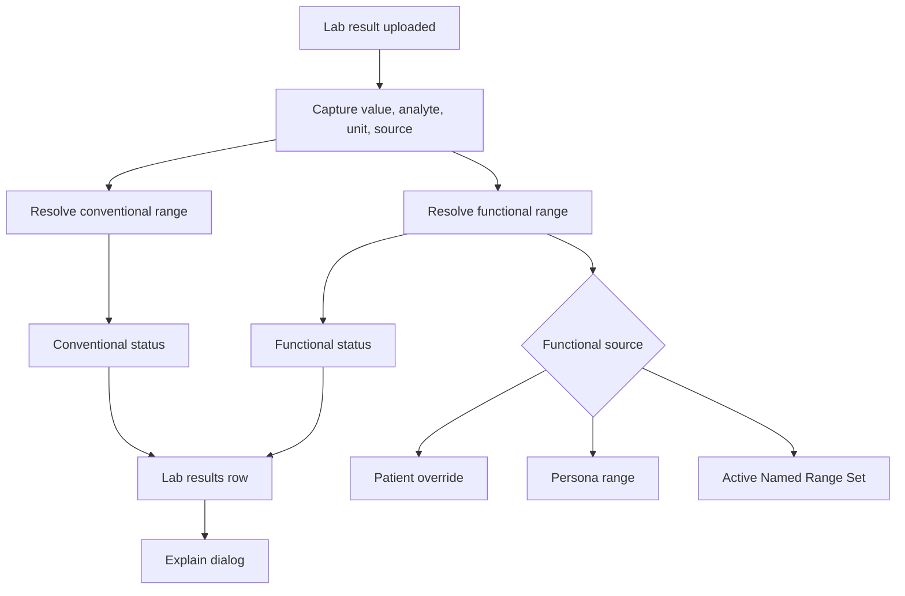

# How Named Range Sets Work
{: .no_toc }

A plain-language guide to how HealthPlus selects functional ranges for patient lab results.
{: .fs-6 .fw-300 }

## Table of contents
{: .no_toc .text-delta }

1. TOC
{:toc}

---

## Plain-Language Overview

A **Named Range Set** is the clinic's selected functional reference framework.

Think of it as the functional medicine rulebook your clinic uses. An optimal wellness practice may use tighter targets. A sports medicine practice may use ranges calibrated for athletic patients. A fertility practice may use cycle-aware hormone targets.

The selected functional set does not replace the laboratory's conventional reference interval. HealthPlus keeps conventional and functional comparisons separate and shows both when available.

---

## Two Separate Range Workflows

| Workflow | Question answered | Example |
|:---------|:------------------|:--------|
| **Conventional reference ranges** | How would the lab or provider compare this result? | Quest HDL female reference interval |
| **Functional Named Range Sets** | How does the clinic's functional framework compare this result? | Optimal Wellness HDL target |

The Range Set Catalog controls the second workflow only: functional ranges.

---

## What Determines Which Functional Range Is Used

Functional range selection is based on objective patient and specimen context.

### Factors That Can Affect the Functional Range

- Specimen type
- Unit
- Biological sex
- Age
- Pregnancy status and trimester
- Menstrual cycle phase for cycle-dependent hormones
- Patient-specific override
- Persona or cohort assignment

### Factors That Do Not Change Numeric Range Boundaries

- Current symptoms
- Clinical suspicion
- Patient preference
- AI interpretation wording
- Whether the conventional range is present or missing

{: .important }
Symptoms can influence interpretation, but they do not move the numeric functional boundaries.

---

## Step-by-Step: What Happens When a Lab Is Uploaded

### Step 1: Result Captured

HealthPlus receives the result value, analyte, unit, specimen type, collection date, and any provider or lab source available from the upload or manual entry.

### Step 2: Conventional Range Resolved Separately

If the report includes a conventional interval, HealthPlus should preserve it for that result. If not, the app looks for a matching provider or clinic conventional reference range.

This step provides conventional comparison only.

### Step 3: Active Functional Set Identified

HealthPlus identifies the clinic's active functional Named Range Set.

If no functional set is active, functional classification cannot be completed. The result may still show a conventional comparison if one exists.

### Step 4: Functional Overrides Checked

The system checks for a more specific functional source:

```
1. Patient-specific functional override
2. Persona or cohort-specific functional range
3. Global functional range from the active Named Range Set
```

The most specific matching range wins.

### Step 5: Result Classified

The measured value is compared against the available ranges.

The row can show:

- Conventional status, if a conventional range exists.
- Functional status, if a functional range exists.
- Coverage gaps, if either range is missing or cannot be compared.

### Step 6: Explanation Generated

The Explain dialog shows:

- Result value and collection date.
- Conventional range source, if available.
- Functional range source, if available.
- Why the applied range was selected.
- Which candidate ranges were available.
- Source notes, citations, and version details.
- Any unit mismatch or missing source warning.

---

## Visual Flow



---

## Example: HDL

For a female patient with HDL of 49.5 mg/dL:

| Item | Example value |
|:-----|:--------------|
| Result value | 49.5 mg/dL |
| Conventional range | Greater than 50 mg/dL, from provider catalog or uploaded report |
| Functional range | 50 - 200 mg/dL, from active functional set |
| Functional classification | Borderline below functional target |

The interpretation should not overstate this as a major abnormality by itself. The Explain dialog should show the boundary distance and the source of both ranges.

---

## Example: Missing HSCRP Ranges

If HSCRP has a result value but no matching conventional or functional range:

- The result value is still real.
- The result cannot be classified against either range type.
- The status should not be treated as normal.
- The Explain dialog should say no reference range is configured.
- A range curation task is needed.

---

## Why This Design Is Explainable

This design keeps each decision traceable:

| Decision | Traceable source |
|:---------|:-----------------|
| Measured value | Lab report, upload, or manual entry |
| Conventional comparison | Provider report, provider catalog, or clinic conventional catalog |
| Functional comparison | Active functional set or override |
| Classification | Numeric comparison against displayed boundaries |
| AI wording | Decision trace, boundary distance, symptoms, and guardrails |

When a source is missing, HealthPlus should display the gap rather than hiding it.

---

## Key Takeaways

- Named Range Sets are functional range frameworks.
- Conventional ranges are managed separately.
- One functional range set should be active at a time.
- Patient and persona overrides can supersede the active functional set.
- Symptoms affect interpretation, not numeric range boundaries.
- Missing ranges are classification gaps, not normal results.

---

## Next Steps

- [Named Range Sets →]()
- [Conventional Reference Ranges →]()
- [Range Sources and Citations →]()
