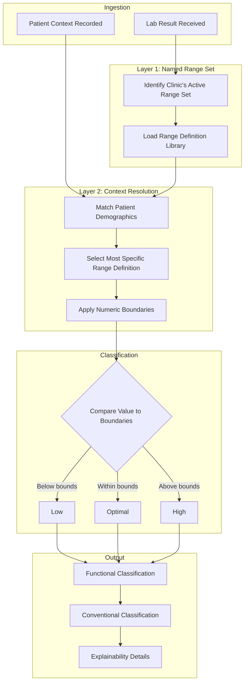

# From Conventional Labs to Functional Meaning
{: .no_toc }

**Who this is for:** Clinicians who want to understand what happens when lab results are uploaded.

---

## Overview

When lab results enter the platform, they go through a systematic process. This document walks through that process step by step, so you understand exactly what happens and why.

---

## Step 1: Lab Data Ingestion

Lab results arrive from your laboratory interface or manual entry.

Each result includes:

- The analyte name or code (for example, TSH)
- The numeric value (for example, 2.1)
- The unit of measurement (for example, mIU/L)
- The specimen type (for example, serum)
- The collection date and time

The platform also records the patient context at the time of collection: age, sex, pregnancy status, and menstrual cycle phase if relevant and recorded.

---

## Step 2: Named Range Set Identification

The platform identifies which Named Range Set your clinic has selected.

This is the foundational reference framework. It determines which library of ranges will be searched for each result.

If your clinic uses "HealthPlus Functional," that entire framework is loaded. If your clinic uses "Athletic Performance," a different framework is loaded.

This step establishes the worldview for all subsequent processing.

---

## Step 3: Context Resolution

Within the selected Named Range Set, the platform finds the most appropriate range definition for this specific patient.

The system considers:

- Biological sex
- Age at time of collection
- Pregnancy status and trimester (if applicable)
- Menstrual cycle phase (if recorded and relevant)
- Specimen type

The platform searches for the most specific match. If a range definition exists for "female, age 30-39, pregnant, trimester 2," that definition is used. If no exact match exists, the system falls back to progressively broader definitions until a match is found.

This ensures that patients receive contextually appropriate ranges, not generic population averages.

---

## Step 4: Numeric Band Classification

The patient's lab value is compared against the selected range boundaries.

The platform classifies the result into bands:

| Band | Meaning |
|:-----|:--------|
| Critical Low | Significantly below the lower bound |
| Low | Below the lower bound |
| Suboptimal Low | Within range but approaching the lower bound |
| Optimal | Well within the reference range |
| Suboptimal High | Within range but approaching the upper bound |
| High | Above the upper bound |
| Critical High | Significantly above the upper bound |

This classification is objective. It is based solely on the numeric value and the selected range boundaries.

---

## Step 5: Conventional Range Preservation

The platform does not discard conventional laboratory reference intervals.

For every result, you can see:

- The functional classification (from the Named Range Set)
- The conventional classification (from standard lab reference intervals)
- The specific boundaries used for each

This dual view ensures you always know how the result would be interpreted by conventional standards, even when using functional ranges.

---

## Step 6: Explainability Output

Every classification is accompanied by an explanation.

The explainability output includes:

- Which Named Range Set was used
- Which specific range definition was selected
- Why that definition was chosen (the matching criteria)
- What alternative definitions existed
- The version of the Named Range Set
- Any citations attached to the range definition

This output is available for every result. You never have to guess why a value was classified the way it was.

---

## Visual Flow

The following diagram illustrates the processing flow:

---

## How Citations Are Attached

Range definitions within a Named Range Set may include citations.

These citations reference the clinical literature or expert consensus that supports the range boundaries. When you view a result, you can see whether the applied range is cited, pending review, or based on expert opinion.

This transparency helps you evaluate the evidence basis for any classification.

---

## How Versioning Works

Named Range Sets are versioned.

When a range set is published, it becomes immutable. No one can change its boundaries after publication. If updates are needed, a new version is created.

Your clinic can choose whether to adopt new versions. Historical results always reference the version that was active when they were processed.

This ensures that interpretations are reproducible. A result processed six months ago will show the same classification it showed then, even if the Named Range Set has since been updated.

---

## Key Takeaways

- Lab results go through a systematic, traceable process.
- The Named Range Set establishes the reference framework.
- Context resolution finds the most specific range for each patient.
- Both functional and conventional classifications are preserved.
- Every classification includes explainability details.
- Versioning ensures reproducibility over time.
