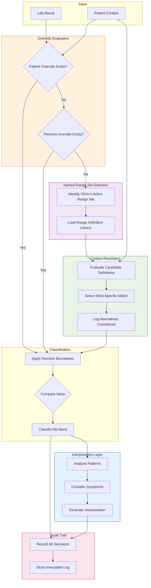

# Technical and Audit-Level Detail
{: .no_toc }

**Who this is for:** Clinical leads, quality reviewers, and auditors who need to understand the system's governance model.

---

## Overview

This document covers the technical foundations that make the platform auditable, defensible, and suitable for clinical governance. It assumes familiarity with the concepts introduced in the previous documents.

---

## Named Range Set Versioning

Every Named Range Set is versioned and immutable once published.

**Lifecycle States:**

| State | Description |
|:------|:------------|
| **Draft** | Under development. Can be modified. Not available for clinical use. |
| **Published** | Locked and immutable. Available for clinic selection. |
| **Deprecated** | No longer recommended. Historical results still reference it. |

When a Named Range Set is published, its contents are frozen. No one can alter the range definitions, boundaries, or metadata after publication.

If updates are needed, a new version is created and published separately. Clinics can then choose whether to adopt the new version.

**Why This Matters:**

Immutability ensures that historical results are reproducible. A result processed six months ago will show the same classification today, because the Named Range Set version it references cannot change.

---

## Deterministic Range Definition Selection

Within a Named Range Set, the platform selects range definitions deterministically.

**Selection Criteria (in order of specificity):**

1. Menstrual cycle phase (if recorded and relevant)
2. Pregnancy status and trimester
3. Age band
4. Biological sex
5. Specimen type

The system searches for the most specific match first. If no exact match exists, it falls back to progressively broader definitions.

**Example:**

For a 32-year-old pregnant female in her second trimester:

1. Look for: female, pregnant, trimester 2, age 30-35
2. If not found: female, pregnant, trimester 2
3. If not found: female, pregnant
4. If not found: female, age 30-35
5. If not found: female (general adult)

This hierarchy is fixed. It does not vary based on the analyte or clinical context. The same patient context always produces the same selection path.

---

## Conflict Resolution

When multiple range definitions could apply, the most specific definition wins.

The platform does not average ranges, blend boundaries, or apply heuristics. It selects one definition — the most specific match — and applies it.

**What "Most Specific" Means:**

A range definition for "female, pregnant, trimester 2" is more specific than one for "female, pregnant," which is more specific than one for "female."

Specificity is determined by how many context criteria the definition includes, not by which criteria they are.

---

## Alternative Ranges Are Logged, Not Applied

During range selection, the platform considers multiple candidate definitions before selecting the most specific one.

These alternative candidates are logged but not applied. The audit trail shows:

- Which definitions were considered
- Why each was or was not selected
- The final selection and its justification

This transparency allows reviewers to verify that the correct definition was applied.

---

## Audit Trail Structure

Every result classification generates an audit record containing:

| Field | Description |
|:------|:------------|
| **Result ID** | Unique identifier for the lab result |
| **Patient Context** | Demographics at time of collection |
| **Named Range Set** | Name and version of the active range set |
| **Range Definition ID** | The specific definition that was applied |
| **Selection Rationale** | Why this definition was chosen |
| **Alternatives Considered** | Other definitions that were evaluated |
| **Numeric Boundaries** | The actual low/high thresholds used |
| **Classification** | The resulting band (low, optimal, high, etc.) |
| **Timestamp** | When the classification was performed |
| **Interpretation ID** | Link to any AI interpretation generated |

This audit record is immutable. It cannot be altered after creation.

---

## Clinic-Specific Overrides

Clinics may create overrides that take precedence over the Named Range Set.

**Override Hierarchy (highest to lowest priority):**

1. **Patient-Specific Override** — A range set by a clinician for one specific patient
2. **Persona Override** — A range defined for a patient cohort (e.g., "Hashimoto's patients")
3. **Named Range Set** — The clinic's selected default framework

When an override exists, it is applied instead of the Named Range Set definition. The audit trail records:

- That an override was applied
- Who created the override
- When it was created
- The override boundaries
- The Named Range Set definition that would have been used otherwise

Overrides are explicit and logged. They are never applied silently.

---

## Detailed Processing Flow

The following diagram shows the complete processing flow including override handling:

---

## Governance Implications

**For Quality Reviews:**

- Every classification can be traced to a specific Named Range Set version
- The selection rationale is documented for each result
- Alternative definitions are logged for comparison
- Overrides are explicit and attributed

**For Regulatory Compliance:**

- Published Named Range Sets are immutable
- Audit trails are immutable
- Versioning ensures reproducibility
- The system does not make diagnostic claims

**For Clinical Accountability:**

- Clinicians can verify which framework was applied
- AI interpretation is clearly labeled as decision support
- Overrides require explicit clinician action
- No silent changes occur to patient classifications

---

## Key Takeaways

- Named Range Sets are versioned and immutable once published.
- Range definition selection is deterministic and based on fixed specificity rules.
- Alternative candidates are logged but not applied.
- Overrides are explicit, logged, and attributed.
- Complete audit trails exist for every classification.
- The system is designed for reproducibility and clinical governance.
