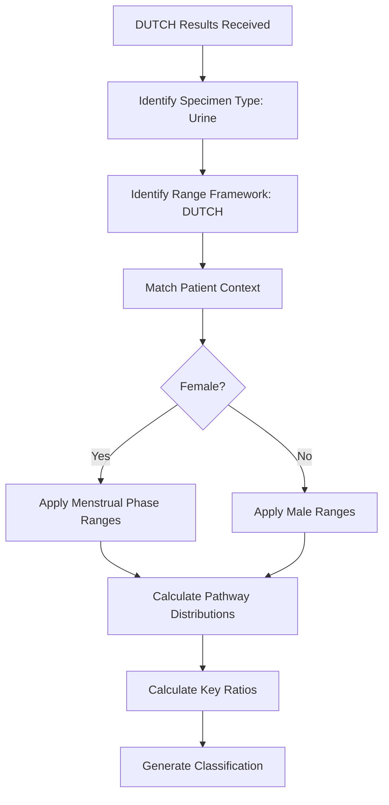

# DUTCH Test
{: .no_toc }

Dried Urine Test for Comprehensive Hormones — a comprehensive look at hormone production and metabolism.
{: .fs-6 .fw-300 }

---

## Table of Contents
{: .no_toc .text-delta }

1. TOC
{:toc}

---

## What Is DUTCH?

DUTCH stands for **Dried Urine Test for Comprehensive Hormones**. It is produced by Precision Analytical.

Unlike serum hormone tests that capture a single moment in time, DUTCH measures hormone metabolites in dried urine samples collected at multiple timepoints throughout the day.

This approach provides:

- **Total hormone production** — not just what's circulating at one moment
- **Metabolic pathway analysis** — how hormones are being processed
- **Diurnal patterns** — how cortisol changes throughout the day
- **Phase I and Phase II metabolism** — detoxification pathway assessment

---

## What DUTCH Measures

### Estrogens and Metabolites

DUTCH measures parent estrogens and tracks how they are metabolized through different pathways:

| Analyte | Type | Clinical Significance |
|:--------|:-----|:----------------------|
| Estrone (E1) | Parent | Primary postmenopausal estrogen |
| Estradiol (E2) | Parent | Primary premenopausal estrogen |
| Estriol (E3) | Parent | Protective estrogen |
| 2-OH-E1, 2-OH-E2 | Phase I metabolite | Protective pathway |
| 4-OH-E1, 4-OH-E2 | Phase I metabolite | Potentially harmful pathway |
| 16-OH-E1 | Phase I metabolite | Proliferative pathway |
| 2-MeO-E1 | Phase II metabolite | Methylation capacity indicator |

### Metabolic Pathways

The platform tracks which pathway estrogens are taking:

```
                    ┌─── 2-OH pathway (protective)
                    │
Estrogens ──────────┼─── 4-OH pathway (potentially harmful)
                    │
                    └─── 16-OH pathway (proliferative)
```

The **2-OH / 4-OH ratio** is a key clinical marker. A ratio above 2.0 indicates healthy protective pathway dominance.

### Progesterone Metabolites

| Analyte | Clinical Use |
|:--------|:-------------|
| α-Pregnanediol | Progesterone production marker |
| β-Pregnanediol | Progesterone production marker |

### Androgens and Metabolites

DUTCH tracks androgen production and the balance between metabolic pathways:

| Analyte | Pathway | Clinical Significance |
|:--------|:--------|:----------------------|
| DHEA | Parent | Adrenal androgen production |
| Testosterone | Parent | Total testosterone production |
| DHT | 5α metabolite | Potent androgen |
| Androsterone | 5α pathway | 5α-reductase activity |
| Etiocholanolone | 5β pathway | 5β-reductase activity |

The **5α / 5β ratio** helps identify patterns associated with conditions like PCOS.

### Cortisol Pattern

DUTCH measures cortisol at multiple timepoints to assess the diurnal rhythm:

| Timepoint | Collection |
|:----------|:-----------|
| Waking | Within 5 minutes of waking |
| CAR +30 | 30 minutes after waking |
| Midday | Afternoon collection |
| Bedtime | Before sleep |

The **Cortisol Awakening Response (CAR)** — the rise in cortisol within 30 minutes of waking — is a key marker of HPA axis function.

### Metabolized Cortisol

| Analyte | Significance |
|:--------|:-------------|
| THF (Tetrahydrocortisol) | Total cortisol production |
| THE (Tetrahydrocortisone) | Cortisone metabolism |
| Free Cortisol / Metabolized Cortisol Ratio | Clearance assessment |

---

## How DUTCH Results Are Processed

When DUTCH results enter the platform:



### Context-Specific Ranges

DUTCH ranges vary by:

- **Sex** — Male vs female baseline ranges
- **Menstrual phase** — Luteal vs follicular vs postmenopausal
- **Medication context** — Oral progesterone affects metabolite ranges

The platform automatically selects the most specific applicable range.

---

## Key Ratios Calculated

The platform automatically calculates DUTCH-specific ratios:

| Ratio | Formula | Optimal | Clinical Meaning |
|:------|:--------|:--------|:-----------------|
| 2-OH / 4-OH | (2-OH-E1 + 2-OH-E2) / (4-OH-E1 + 4-OH-E2) | > 2.0 | Protective vs harmful pathway balance |
| 2-MeO / 2-OH | 2-MeO-E1 / 2-OH-E1 | > 0.5 | Methylation efficiency |
| 5α / 5β | Androsterone / Etiocholanolone | < 1.0 typical | Androgen metabolism pathway preference |
| Pg / E2 | Total Progesterone / Total Estradiol | 100-200 luteal | Progesterone-estrogen balance |

---

## Collection Requirements

DUTCH requires specific collection timing:

1. **Multiple samples** — 4 to 5 dried urine samples over 24 hours
2. **Timed collections** — Waking, CAR+30, afternoon, bedtime
3. **Cycle timing** — For premenopausal women, collected day 19-22 (luteal phase)

The platform tracks collection timepoints and flags results if timing requirements were not met.

---

## Named Range Set Integration

DUTCH results work within the Named Range Set system:

1. **The clinic selects a Named Range Set** — This establishes the interpretive worldview
2. **DUTCH analytes use DUTCH-specific ranges** — The range framework ensures appropriate boundaries
3. **Context resolution applies** — Patient demographics further refine which ranges apply
4. **Interpretation considers DUTCH-specific patterns** — Pathway analysis informs clinical summary

---

## Key Takeaways

- DUTCH measures hormone metabolites in dried urine, not serum levels
- Metabolic pathway tracking (2-OH, 4-OH, 16-OH) provides detoxification insight
- Diurnal cortisol patterns assess HPA axis function
- The platform applies DUTCH-specific reference ranges automatically
- Key ratios are calculated to support clinical interpretation

