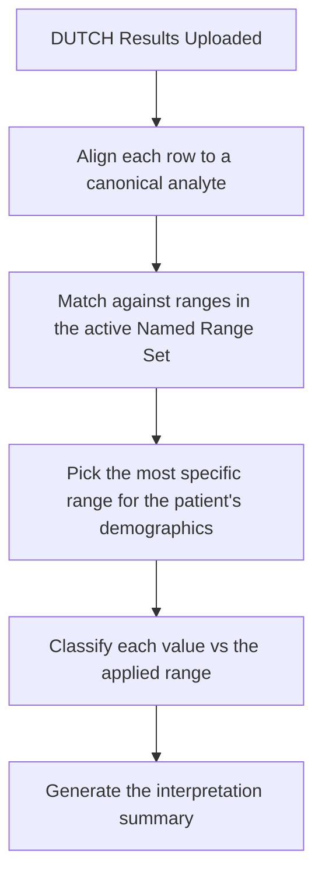

# DUTCH Test
{: .no_toc }

Dried Urine Test for Comprehensive Hormones — a comprehensive look at hormone production and metabolism.
{: .fs-6 .fw-300 }

---

## Table of Contents
{: .no_toc .text-delta }

1. TOC
{:toc}

---

## What Is DUTCH?

DUTCH stands for **Dried Urine Test for Comprehensive Hormones**. It is produced by Precision Analytical.

Unlike serum hormone tests that capture a single moment in time, DUTCH measures hormone metabolites in dried urine samples collected at multiple timepoints throughout the day.

This approach provides:

- **Total hormone production** — not just what's circulating at one moment
- **Metabolic pathway analysis** — how hormones are being processed
- **Diurnal patterns** — how cortisol changes throughout the day
- **Phase I and Phase II metabolism** — detoxification pathway assessment

---

## What DUTCH Measures

### Estrogens and Metabolites

DUTCH measures parent estrogens and tracks how they are metabolized through different pathways:

| Analyte | Type | Clinical Significance |
|:--------|:-----|:----------------------|
| Estrone (E1) | Parent | Primary postmenopausal estrogen |
| Estradiol (E2) | Parent | Primary premenopausal estrogen |
| Estriol (E3) | Parent | Protective estrogen |
| 2-OH-E1, 2-OH-E2 | Phase I metabolite | Protective pathway |
| 4-OH-E1, 4-OH-E2 | Phase I metabolite | Potentially harmful pathway |
| 16-OH-E1 | Phase I metabolite | Proliferative pathway |
| 2-MeO-E1 | Phase II metabolite | Methylation capacity indicator |

### Metabolic Pathways

The platform tracks which pathway estrogens are taking:

```
                    ┌─── 2-OH pathway (protective)
                    │
Estrogens ──────────┼─── 4-OH pathway (potentially harmful)
                    │
                    └─── 16-OH pathway (proliferative)
```

The **2-OH / 4-OH ratio** is a key clinical marker. A ratio above 2.0 indicates healthy protective pathway dominance.

### Progesterone Metabolites

| Analyte | Clinical Use |
|:--------|:-------------|
| α-Pregnanediol | Progesterone production marker |
| β-Pregnanediol | Progesterone production marker |

### Androgens and Metabolites

DUTCH tracks androgen production and the balance between metabolic pathways:

| Analyte | Pathway | Clinical Significance |
|:--------|:--------|:----------------------|
| DHEA | Parent | Adrenal androgen production |
| Testosterone | Parent | Total testosterone production |
| DHT | 5α metabolite | Potent androgen |
| Androsterone | 5α pathway | 5α-reductase activity |
| Etiocholanolone | 5β pathway | 5β-reductase activity |

The **5α / 5β ratio** helps identify patterns associated with conditions like PCOS.

### Cortisol Pattern

DUTCH measures cortisol at multiple timepoints to assess the diurnal rhythm:

| Timepoint | Collection |
|:----------|:-----------|
| Waking | Within 5 minutes of waking |
| CAR +30 | 30 minutes after waking |
| Midday | Afternoon collection |
| Bedtime | Before sleep |

The **Cortisol Awakening Response (CAR)** — the rise in cortisol within 30 minutes of waking — is a key marker of HPA axis function.

### Metabolized Cortisol

| Analyte | Significance |
|:--------|:-------------|
| THF (Tetrahydrocortisol) | Total cortisol production |
| THE (Tetrahydrocortisone) | Cortisone metabolism |
| Free Cortisol / Metabolized Cortisol Ratio | Clearance assessment |

---

## How DUTCH Results Are Processed

When DUTCH results are uploaded, each row is aligned to a canonical analyte and then
matched to whatever reference range best fits the patient's demographics:


```mermaid
flowchart TD
    A[DUTCH Results Uploaded] --> B[Align each row to a canonical analyte]
    B --> C[Match against ranges in the active Named Range Set]
    C --> D[Pick the most specific range for the patient's demographics]
    D --> E[Classify each value vs the applied range]
    E --> F[Generate the interpretation summary]
```

> **How ranges are actually chosen.** HealthPlus does not have a "DUTCH range
> framework." Ranges are matched by patient **demographics** (sex, age, and — where
> such ranges are authored — pregnancy and menstrual phase) against the clinic's active
> Named Range Set. Named Range Sets express a clinical philosophy, not a lab or
> methodology: the app deliberately rejects naming a set `DUTCH`, `ZRT`, `NutrEval`, or
> `Genova` ("DUTCH is a specimen methodology, not a clinical philosophy"). Individual
> range definitions instead carry a `specimen_type`. The platform does **not** compute
> metabolite pathway distributions or ratios (see the note under *Key Ratios*).

### Context-Specific Ranges

Range matching supports demographic specificity — when ranges are authored for those
dimensions, the most specific applicable range wins:

- **Sex** — Male vs female baseline ranges
- **Age** — Age-bounded ranges
- **Menstrual phase / pregnancy** — Most-specific when such ranges exist

The matching engine ranks a menstrual-phase or pregnancy range as more specific than a
sex- or age-only range. However, this is an **authoring capability, not shipped
behavior for DUTCH today**: the seeded functional ranges are adult (age 18–100) with no
menstrual-phase or pregnancy values populated (tracked by app issue
[healthplus#38](https://github.com/Hulupeep/healthplus/issues/38)), so no cycle- or
trimester-specific substitution happens until a clinic authors those ranges. Medication
context is **not** a range-matching dimension.

---

## Key Ratios (DUTCH methodology)

> **Illustrative only — not computed by HealthPlus.** HealthPlus does not calculate
> metabolite ratios or pathway distributions. The ratios below are concepts from the
> DUTCH report itself, included here to explain what the test measures; the numeric
> values are illustrative and are **not** reference values applied by the platform.
> HealthPlus classifies each uploaded analyte value against its configured, sourced
> range and never invents ratios or thresholds.

| Ratio | Formula | Clinical Meaning (per DUTCH methodology) |
|:------|:--------|:-----------------------------------------|
| 2-OH / 4-OH | (2-OH-E1 + 2-OH-E2) / (4-OH-E1 + 4-OH-E2) | Protective vs harmful pathway balance |
| 2-MeO / 2-OH | 2-MeO-E1 / 2-OH-E1 | Methylation efficiency |
| 5α / 5β | Androsterone / Etiocholanolone | Androgen metabolism pathway preference |
| Pg / E2 | Total Progesterone / Total Estradiol | Progesterone-estrogen balance |

---

## Collection Requirements

DUTCH requires specific collection timing:

1. **Multiple samples** — 4 to 5 dried urine samples over 24 hours
2. **Timed collections** — Waking, CAR+30, afternoon, bedtime
3. **Cycle timing** — For premenopausal women, collected day 19-22 (luteal phase)

These are collection requirements of the DUTCH test itself. HealthPlus records the
values that are uploaded; it does not track collection timepoints or flag results for
timing compliance.

---

## Named Range Set Integration

DUTCH results work within the Named Range Set system:

1. **The clinic selects a Named Range Set** — This establishes the interpretive philosophy (a Named Range Set is a clinical worldview, never a lab or methodology name like "DUTCH")
2. **DUTCH analytes resolve to canonical analytes** — Uploaded DUTCH rows align to the platform's canonical catalog; each range definition carries its own `specimen_type`
3. **Context resolution applies** — Patient demographics (sex, age, and any authored pregnancy/menstrual ranges) refine which range is applied
4. **Interpretation classifies each value against its applied range** — Using the configured, sourced ranges; the platform does not derive DUTCH pathway/ratio patterns

---

## Key Takeaways

- DUTCH measures hormone metabolites in dried urine, not serum levels
- Metabolic pathway tracking (2-OH, 4-OH, 16-OH) is part of the DUTCH report's own interpretation
- Diurnal cortisol patterns assess HPA axis function
- HealthPlus classifies uploaded DUTCH values against configured, sourced ranges matched by patient demographics — it does not apply a "DUTCH range framework" or compute pathway ratios
- Pathway ratios and thresholds shown here are illustrative of the DUTCH methodology, not values the platform calculates

