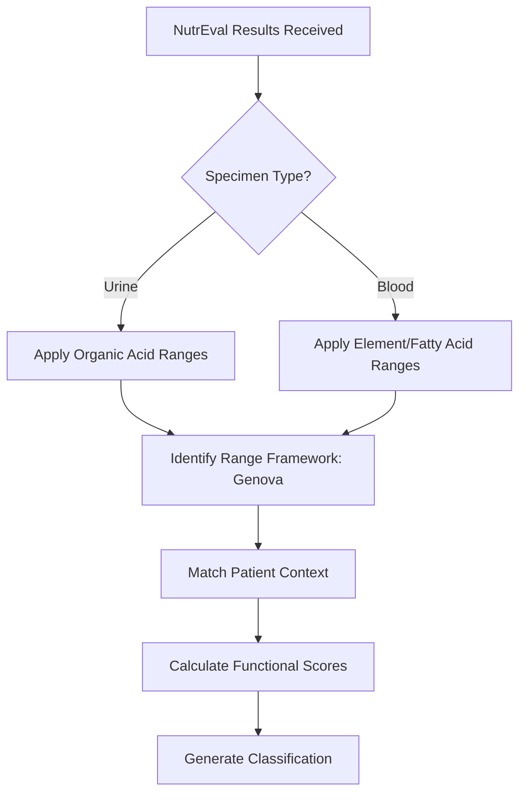

# NutrEval
{: .no_toc }

Comprehensive nutritional and metabolic assessment from Genova Diagnostics.
{: .fs-6 .fw-300 }

---

## Table of Contents
{: .no_toc .text-delta }

1. TOC
{:toc}

---

## What Is NutrEval?

NutrEval is a comprehensive nutritional evaluation produced by Genova Diagnostics. It combines two specimen types to provide a complete metabolic picture:

- **First Morning Void (FMV) Urine** — Organic acids and metabolites
- **Blood** — Elements, fatty acids, amino acids

This dual-specimen approach assesses nutritional status, cellular energy production, detoxification capacity, and gut health through metabolic markers.

---

## Specimen Requirements

NutrEval requires two specimen types:

| Specimen | Collection | What It Measures |
|:---------|:-----------|:-----------------|
| **FMV Urine** | First morning void | Organic acids, B-vitamin markers, dysbiosis markers |
| **Blood (Serum/Plasma)** | Standard draw | Elements, fatty acids, amino acids |

The platform tracks both specimen types and ensures appropriate ranges are applied to each analyte based on its specimen source.

---

## What NutrEval Measures

### Organic Acids (Urine)

Organic acids are metabolic intermediates that provide insight into cellular function:

#### Malabsorption and Dysbiosis Markers

| Analyte | Elevated Indicates |
|:--------|:-------------------|
| Indoleacetic Acid | Bacterial overgrowth (*Clostridia*) |
| Phenylacetic Acid | Anaerobic bacterial overgrowth |
| Benzoic Acid | Bacterial metabolism, preservative exposure |
| Hippuric Acid | Bacterial overgrowth, toluene exposure |

#### Yeast/Fungal Markers

| Analyte | Elevated Indicates |
|:--------|:-------------------|
| D-Arabinitol | *Candida* overgrowth |
| Citramalic Acid | Yeast overgrowth |
| Tartaric Acid | *Aspergillus*, yeast overgrowth |

#### Cellular Energy Markers

| Analyte | Function | Low/High Meaning |
|:--------|:---------|:-----------------|
| Citric Acid | Krebs cycle entry | Low = substrate deficiency |
| Succinic Acid | Krebs cycle | High = CoQ10/B2 deficiency |
| Pyruvic Acid | Carbohydrate metabolism | High = B-vitamin deficiency |
| Lactic Acid | Anaerobic metabolism | High = oxygen/mitochondrial issue |

#### Vitamin Markers

| Analyte | Indicates Need For |
|:--------|:-------------------|
| Methylmalonic Acid (MMA) | Vitamin B12 |
| FIGLU | Folate |
| Xanthurenate | Vitamin B6 |
| α-Ketoadipic Acid | B1, B2, B3, B5, Lipoic Acid |
| Glutaric Acid | Vitamin B2 (Riboflavin) |

### Elements (Blood)

| Element | Clinical Significance |
|:--------|:----------------------|
| Magnesium (RBC) | Intracellular status |
| Zinc | Immune function, wound healing |
| Copper | Ceruloplasmin, inflammation |
| Selenium | Thyroid conversion, antioxidant |
| Chromium | Glucose metabolism |
| Manganese | Mitochondrial SOD |

### Toxic Elements (Blood/Urine)

| Element | Source |
|:--------|:-------|
| Lead | Environmental exposure |
| Mercury | Dental, seafood |
| Arsenic | Water, food |
| Cadmium | Smoking, industrial |

### Fatty Acids (Blood)

| Category | Markers |
|:---------|:--------|
| Omega-3 | EPA, DHA, ALA |
| Omega-6 | Arachidonic acid, LA |
| Saturated | Palmitic, Stearic |
| Monounsaturated | Oleic acid |
| Omega-3 Index | EPA + DHA percentage |

---

## Interpretation Scores

NutrEval provides functional need scores that aggregate related markers:

| Score | What It Assesses |
|:------|:-----------------|
| Microbiome Support | Gut dysbiosis severity |
| Digestive Support | Enzyme/absorption needs |
| Mitochondrial Dysfunction | Cellular energy status |
| Need for Methylation | B12/folate methylation capacity |
| Toxic Exposure | Environmental toxin burden |
| Oxidative Stress | Free radical damage |

These scores help prioritize interventions.

---

## How NutrEval Results Are Processed

### Dual-Specimen Handling

The platform:

1. **Separates results by specimen type** — Urine analytes get urine ranges, blood analytes get blood ranges
2. **Applies Genova range framework** — NutrEval-specific reference intervals
3. **Calculates aggregate scores** — Combines related markers into functional need scores
4. **Integrates with Named Range Set** — Functional interpretation layered on top

---

## Clinical Use Cases

### Fatigue Workup

NutrEval helps identify:
- Mitochondrial dysfunction (Krebs cycle markers)
- B-vitamin deficiencies (MMA, FIGLU, α-keto acids)
- Iron/ferritin status
- Fatty acid imbalances affecting cell membranes

### Gut Health Assessment

NutrEval identifies:
- Bacterial overgrowth (multiple organic acid markers)
- Yeast overgrowth (D-Arabinitol, Citramalic)
- Digestive enzyme need
- Malabsorption patterns

### Detoxification Assessment

NutrEval evaluates:
- Toxic element burden
- Glutathione status (Pyroglutamate)
- Methylation capacity
- Phase II conjugation

---

## Named Range Set Integration

NutrEval results work within the Named Range Set system:

1. **Genova ranges are the methodology baseline**
2. **Named Range Set provides interpretive philosophy**
3. **Functional scores inform clinical summary**
4. **Interpretation explains nutritional patterns**

---

## Key Takeaways

- NutrEval combines urine organic acids with blood elements and fatty acids
- Organic acids reveal cellular metabolism and gut health
- Elements assess nutritional status and toxic burden
- Functional scores aggregate related markers for clinical prioritization
- The platform handles dual-specimen testing with appropriate range framework per analyte

