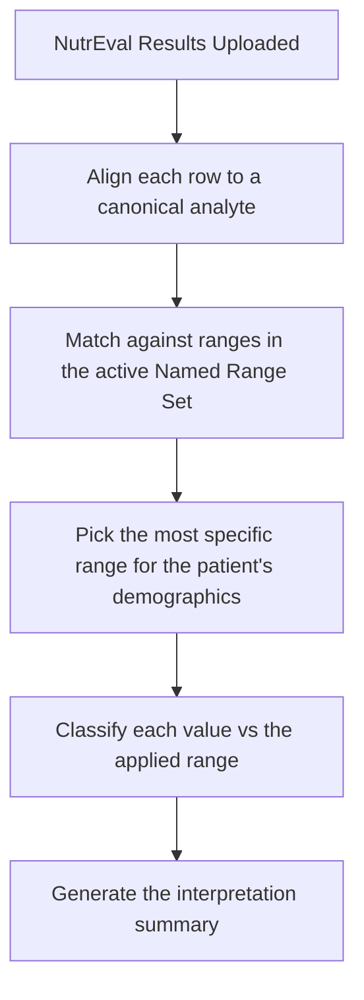

# NutrEval
{: .no_toc }

Comprehensive nutritional and metabolic assessment from Genova Diagnostics.
{: .fs-6 .fw-300 }

---

## Table of Contents
{: .no_toc .text-delta }

1. TOC
{:toc}

---

## What Is NutrEval?

NutrEval is a comprehensive nutritional evaluation produced by Genova Diagnostics. It combines two specimen types to provide a complete metabolic picture:

- **First Morning Void (FMV) Urine** — Organic acids and metabolites
- **Blood** — Elements, fatty acids, amino acids

This dual-specimen approach assesses nutritional status, cellular energy production, detoxification capacity, and gut health through metabolic markers.

---

## Specimen Requirements

NutrEval requires two specimen types:

| Specimen | Collection | What It Measures |
|:---------|:-----------|:-----------------|
| **FMV Urine** | First morning void | Organic acids, B-vitamin markers, dysbiosis markers |
| **Blood (Serum/Plasma)** | Standard draw | Elements, fatty acids, amino acids |

Each range definition carries its own `specimen_type`, so urine and blood analytes can hold distinct ranges. Note that HealthPlus selects which range to apply by patient **demographics** (see *How NutrEval Results Are Processed* below), not by specimen — `specimen_type` is recorded on the definition, it is not itself a matching dimension.

---

## What NutrEval Measures

### Organic Acids (Urine)

Organic acids are metabolic intermediates that provide insight into cellular function:

#### Malabsorption and Dysbiosis Markers

| Analyte | Elevated Indicates |
|:--------|:-------------------|
| Indoleacetic Acid | Bacterial overgrowth (*Clostridia*) |
| Phenylacetic Acid | Anaerobic bacterial overgrowth |
| Benzoic Acid | Bacterial metabolism, preservative exposure |
| Hippuric Acid | Bacterial overgrowth, toluene exposure |

#### Yeast/Fungal Markers

| Analyte | Elevated Indicates |
|:--------|:-------------------|
| D-Arabinitol | *Candida* overgrowth |
| Citramalic Acid | Yeast overgrowth |
| Tartaric Acid | *Aspergillus*, yeast overgrowth |

#### Cellular Energy Markers

| Analyte | Function | Low/High Meaning |
|:--------|:---------|:-----------------|
| Citric Acid | Krebs cycle entry | Low = substrate deficiency |
| Succinic Acid | Krebs cycle | High = CoQ10/B2 deficiency |
| Pyruvic Acid | Carbohydrate metabolism | High = B-vitamin deficiency |
| Lactic Acid | Anaerobic metabolism | High = oxygen/mitochondrial issue |

#### Vitamin Markers

| Analyte | Indicates Need For |
|:--------|:-------------------|
| Methylmalonic Acid (MMA) | Vitamin B12 |
| FIGLU | Folate |
| Xanthurenate | Vitamin B6 |
| α-Ketoadipic Acid | B1, B2, B3, B5, Lipoic Acid |
| Glutaric Acid | Vitamin B2 (Riboflavin) |

### Elements (Blood)

| Element | Clinical Significance |
|:--------|:----------------------|
| Magnesium (RBC) | Intracellular status |
| Zinc | Immune function, wound healing |
| Copper | Ceruloplasmin, inflammation |
| Selenium | Thyroid conversion, antioxidant |
| Chromium | Glucose metabolism |
| Manganese | Mitochondrial SOD |

### Toxic Elements (Blood/Urine)

| Element | Source |
|:--------|:-------|
| Lead | Environmental exposure |
| Mercury | Dental, seafood |
| Arsenic | Water, food |
| Cadmium | Smoking, industrial |

### Fatty Acids (Blood)

| Category | Markers |
|:---------|:--------|
| Omega-3 | EPA, DHA, ALA |
| Omega-6 | Arachidonic acid, LA |
| Saturated | Palmitic, Stearic |
| Monounsaturated | Oleic acid |
| Omega-3 Index | EPA + DHA percentage |

---

## Interpretation Scores (NutrEval report concepts)

> **Illustrative only — not computed by HealthPlus.** The functional need scores below
> are aggregate concepts from Genova's own NutrEval report; HealthPlus does **not**
> calculate them. There is no score-aggregation engine in the platform — HealthPlus
> classifies each uploaded analyte value against its configured, sourced range and does
> not combine markers into aggregate "need" scores. They are included here to explain
> what the NutrEval report itself presents.

NutrEval's own report groups related markers into functional need scores:

| Score | What It Assesses |
|:------|:-----------------|
| Microbiome Support | Gut dysbiosis severity |
| Digestive Support | Enzyme/absorption needs |
| Mitochondrial Dysfunction | Cellular energy status |
| Need for Methylation | B12/folate methylation capacity |
| Toxic Exposure | Environmental toxin burden |
| Oxidative Stress | Free radical damage |

On the NutrEval report these scores help prioritize interventions.

---

## How NutrEval Results Are Processed

```mermaid
flowchart TD
    A[NutrEval Results Uploaded] --> B[Align each row to a canonical analyte]
    B --> C[Match against ranges in the active Named Range Set]
    C --> D[Pick the most specific range for the patient's demographics]
    D --> E[Classify each value vs the applied range]
    E --> F[Generate the interpretation summary]
```

> **How ranges are actually chosen.** HealthPlus does not have a "Genova range
> framework." Ranges are matched by patient **demographics** (sex, age, and — where such
> ranges are authored — pregnancy and menstrual phase) against the clinic's active Named
> Range Set. Named Range Sets express a clinical philosophy, not a lab or methodology:
> the app deliberately rejects naming a set `NutrEval`, `Genova`, `DUTCH`, or `ZRT`
> ("Genova is a laboratory, not a clinical philosophy"). Individual range definitions
> instead carry a `specimen_type`.

### Dual-Specimen Handling

The platform:

1. **Records each analyte's specimen** — Range definitions carry a `specimen_type`, so a urine analyte and a blood analyte can hold distinct ranges
2. **Matches ranges by demographics** — The most specific applicable range for the patient's sex/age (and any authored pregnancy/menstrual ranges) wins; there is no "Genova framework" keying and specimen is not itself a matching dimension
3. **Classifies each value against its applied range** — Using the configured, sourced ranges; HealthPlus does not combine markers into aggregate functional-need scores
4. **Integrates with the Named Range Set** — Functional interpretation layered on top

---

## Clinical Use Cases

### Fatigue Workup

NutrEval helps identify:
- Mitochondrial dysfunction (Krebs cycle markers)
- B-vitamin deficiencies (MMA, FIGLU, α-keto acids)
- Iron/ferritin status
- Fatty acid imbalances affecting cell membranes

### Gut Health Assessment

NutrEval identifies:
- Bacterial overgrowth (multiple organic acid markers)
- Yeast overgrowth (D-Arabinitol, Citramalic)
- Digestive enzyme need
- Malabsorption patterns

### Detoxification Assessment

NutrEval evaluates:
- Toxic element burden
- Glutathione status (Pyroglutamate)
- Methylation capacity
- Phase II conjugation

---

## Named Range Set Integration

NutrEval results work within the Named Range Set system:

1. **The clinic selects a Named Range Set** — This establishes the interpretive philosophy (a Named Range Set is a clinical worldview, never a lab or methodology name like "NutrEval" or "Genova")
2. **NutrEval analytes resolve to canonical analytes** — Uploaded rows align to the platform's canonical catalog; each range definition carries its own `specimen_type`
3. **Context resolution applies** — Patient demographics (sex, age, and any authored pregnancy/menstrual ranges) refine which range is applied
4. **Interpretation classifies each value against its applied range** — Using the configured, sourced ranges; the platform does not compute NutrEval functional-need scores

---

## Key Takeaways

- NutrEval combines urine organic acids with blood elements and fatty acids
- Organic acids reveal cellular metabolism and gut health
- Elements assess nutritional status and toxic burden
- Functional-need scores (Microbiome Support, Mitochondrial Dysfunction, …) are concepts from Genova's own NutrEval report, not values HealthPlus calculates
- HealthPlus classifies uploaded NutrEval values against configured, sourced ranges matched by patient demographics — it does not apply a "Genova range framework" or compute aggregate scores

