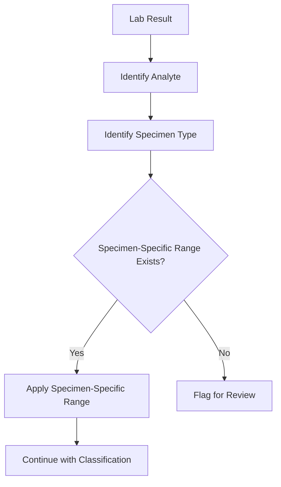

# Specimen Types
{: .no_toc }

Technical details on how the platform handles different specimen types.
{: .fs-6 .fw-300 }

---

## Table of Contents
{: .no_toc .text-delta }

1. TOC
{:toc}

---

## Supported Specimen Types

The platform supports all major clinical specimen types:

| Specimen Type | Description | Common Tests |
|:--------------|:------------|:-------------|
| **Serum** | Blood with clot removed | Most chemistry, hormones |
| **Plasma** | Blood with anticoagulant | Coagulation, some hormones |
| **Whole Blood** | Unprocessed blood | CBC, dried blood spot |
| **Urine** | Random or timed void | DUTCH, organic acids, drug screens |
| **Saliva** | Oral fluid | Cortisol, some hormones |
| **Stool** | Fecal sample | GI panels, microbiome |
| **CSF** | Cerebrospinal fluid | Neurological markers (rare) |

---

## Blood Specimens

### Serum

**What it is:** Blood collected in a tube without anticoagulant, allowed to clot, then centrifuged to separate the liquid portion.

**Used for:**
- Comprehensive metabolic panels
- Lipid panels
- Thyroid panels
- Most hormone tests
- Vitamin and mineral levels

**Platform handling:**
- Most analytes default to serum when blood is the specimen
- ZRT serum panels use this specimen type
- Ranges are specific to serum concentrations

### Plasma

**What it is:** Blood collected with anticoagulant (like EDTA or heparin), centrifuged without clotting.

**Used for:**
- Coagulation studies
- Some hormone tests
- Amino acid profiles

**Platform handling:**
- Distinct from serum in the specimen_type field
- Some analytes may have different ranges for plasma vs serum

### Whole Blood

**What it is:** Unprocessed blood, including cells and plasma.

**Used for:**
- Complete blood count (CBC)
- Hemoglobin A1c
- Dried blood spot testing

**Platform handling:**
- Tracked separately from serum/plasma
- DBS (dried blood spot) tests use this category

---

## Urine Specimens

### Types of Urine Collection

| Collection | Timing | Used For |
|:-----------|:-------|:---------|
| **Random** | Any time | Screening, qualitative tests |
| **First Morning Void (FMV)** | Upon waking | NutrEval organic acids |
| **Timed (24-hour)** | Full day collection | Creatinine clearance, hormone totals |
| **Dried Urine** | Multiple timed samples | DUTCH test |

### DUTCH Collection Protocol

DUTCH uses dried urine on filter paper collected at specific times:

| Sample | Timing | Purpose |
|:-------|:-------|:--------|
| 1 | Upon waking | Baseline cortisol |
| 2 | 30 min after waking | CAR assessment |
| 3 | Afternoon (2-4pm) | Midday cortisol |
| 4 | Bedtime | Evening cortisol |
| 5 | Optional overnight | Total hormone production |

The platform tracks collection timepoints and validates that timing requirements were met.

---

## Saliva Specimens

**What it is:** Oral fluid collected by passive drool or absorbent device.

**Used for:**
- Cortisol (especially diurnal patterns)
- Some steroid hormones
- Cortisol Awakening Response (CAR)

**Advantages:**
- Non-invasive
- Easy multiple-timepoint collection
- Measures free (unbound) hormone

**Platform handling:**
- Tracked as distinct specimen type
- Saliva cortisol ranges differ from serum cortisol ranges
- Timed collection protocols supported

---

## Stool Specimens

**What it is:** Fecal sample collected at home.

**Used for:**
- Comprehensive stool analysis
- Microbiome assessment
- Parasitology
- Digestive function markers (elastase, fats)

**Platform handling:**
- Tracked as distinct specimen type
- GI-specific analytes bound to stool specimen

---

## How Specimen Type Affects Range Selection

The platform uses specimen type as a key criterion for range selection:



### Example: Testosterone

| Specimen | Unit | Range Framework | Male Reference |
|:---------|:-----|:----------------|:---------------|
| Serum | ng/dL | ZRT | 400-1000 |
| Urine | ng/mg | DUTCH | 40-100 |
| Saliva | pg/mL | ZRT | 50-200 |

The same hormone has different units and ranges depending on specimen type. The platform ensures the correct range is applied.

---

## Specimen-Analyte Binding

Each analyte in the platform declares which specimen types it supports:

```
Analyte: Estradiol (E2)
Supported specimens: [serum, urine, saliva]

Analyte: D-Arabinitol
Supported specimens: [urine]

Analyte: Hemoglobin
Supported specimens: [whole_blood]
```

When results are ingested, the platform verifies that the specimen type matches a supported type for that analyte.

---

## Collection Timing

Some tests require specific collection timing:

### Time-of-Day Dependent

| Test | Optimal Timing | Why |
|:-----|:---------------|:----|
| Morning Cortisol | 7-9 AM | Peak of diurnal rhythm |
| Fasting Glucose | Morning, fasted | Removes meal influence |
| Fasting Insulin | Morning, fasted | Removes meal influence |

### Cycle-Phase Dependent

| Test | Optimal Timing | Why |
|:-----|:---------------|:----|
| Progesterone | Day 19-22 | Luteal peak |
| Estradiol | Day 3 or Day 19-22 | Phase-specific |
| FSH/LH | Day 3 | Baseline assessment |

### Multiple Timepoint

| Test | Protocol | Why |
|:-----|:---------|:----|
| Cortisol Diurnal | 4+ samples over day | Rhythm assessment |
| CAR | Waking + 30 min | Awakening response |
| OGTT | 0, 30, 60, 120 min | Glucose tolerance |

The platform tracks collection timing and flags results where timing requirements were not documented.

---

## Key Takeaways

- The platform supports all major clinical specimen types
- Specimen type determines which reference ranges apply
- The same analyte may have different ranges for different specimens
- Collection timing is tracked for time-sensitive tests
- Analytes declare which specimen types they support

