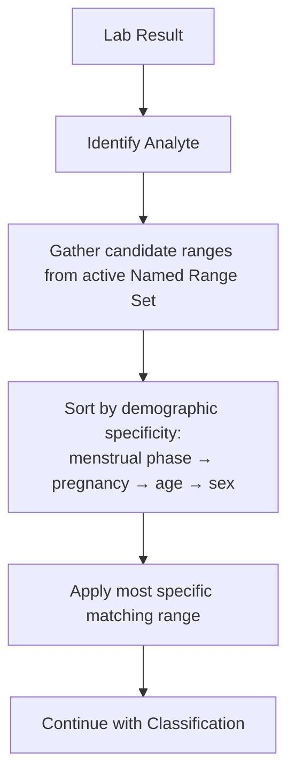

# Specimen Types
{: .no_toc }

Technical details on how the platform handles different specimen types.
{: .fs-6 .fw-300 }

---

## Table of Contents
{: .no_toc .text-delta }

1. TOC
{:toc}

---

## Supported Specimen Types

The platform supports all major clinical specimen types:

| Specimen Type | Description | Common Tests |
|:--------------|:------------|:-------------|
| **Serum** | Blood with clot removed | Most chemistry, hormones |
| **Plasma** | Blood with anticoagulant | Coagulation, some hormones |
| **Whole Blood** | Unprocessed blood | CBC, dried blood spot |
| **Urine** | Random or timed void | DUTCH, organic acids, drug screens |
| **Saliva** | Oral fluid | Cortisol, some hormones |
| **Stool** | Fecal sample | GI panels, microbiome |
| **CSF** | Cerebrospinal fluid | Neurological markers (rare) |

---

## Blood Specimens

### Serum

**What it is:** Blood collected in a tube without anticoagulant, allowed to clot, then centrifuged to separate the liquid portion.

**Used for:**
- Comprehensive metabolic panels
- Lipid panels
- Thyroid panels
- Most hormone tests
- Vitamin and mineral levels

**Platform handling:**
- Serum is recorded as the `specimen_type` on a result and can be stored on range and analyte definitions as descriptive metadata
- `specimen_type` is a stored descriptive field — it is **not** a range-selection key (see [How Specimen Type Is Used](#how-specimen-type-is-used) below)

### Plasma

**What it is:** Blood collected with anticoagulant (like EDTA or heparin), centrifuged without clotting.

**Used for:**
- Coagulation studies
- Some hormone tests
- Amino acid profiles

**Platform handling:**
- Distinct from serum in the specimen_type field
- Some analytes may have different ranges for plasma vs serum

### Whole Blood

**What it is:** Unprocessed blood, including cells and plasma.

**Used for:**
- Complete blood count (CBC)
- Hemoglobin A1c
- Dried blood spot testing

**Platform handling:**
- Tracked separately from serum/plasma
- DBS (dried blood spot) tests use this category

---

## Urine Specimens

### Types of Urine Collection

| Collection | Timing | Used For |
|:-----------|:-------|:---------|
| **Random** | Any time | Screening, qualitative tests |
| **First Morning Void (FMV)** | Upon waking | NutrEval organic acids |
| **Timed (24-hour)** | Full day collection | Creatinine clearance, hormone totals |
| **Dried Urine** | Multiple timed samples | DUTCH test |

### DUTCH Collection Protocol

DUTCH uses dried urine on filter paper collected at specific times:

| Sample | Timing | Purpose |
|:-------|:-------|:--------|
| 1 | Upon waking | Baseline cortisol |
| 2 | 30 min after waking | CAR assessment |
| 3 | Afternoon (2-4pm) | Midday cortisol |
| 4 | Bedtime | Evening cortisol |
| 5 | Optional overnight | Total hormone production |

*The collection schedule above is defined by the DUTCH test itself, not by HealthPlus.* The data model includes `collection_timepoints`/`analyte_timepoints` tables to record which timepoint a sample belongs to, but the platform does **not** independently validate that a specimen's timing requirements were met.

---

## Saliva Specimens

**What it is:** Oral fluid collected by passive drool or absorbent device.

**Used for:**
- Cortisol (especially diurnal patterns)
- Some steroid hormones
- Cortisol Awakening Response (CAR)

**Advantages:**
- Non-invasive
- Easy multiple-timepoint collection
- Measures free (unbound) hormone

**Platform handling:**
- Tracked as distinct specimen type
- Saliva cortisol ranges differ from serum cortisol ranges
- Timed collection protocols supported

---

## Stool Specimens

**What it is:** Fecal sample collected at home.

**Used for:**
- Comprehensive stool analysis
- Microbiome assessment
- Parasitology
- Digestive function markers (elastase, fats)

**Platform handling:**
- Tracked as distinct specimen type
- GI-specific analytes bound to stool specimen

---

## How Specimen Type Is Used

**Range selection is driven by patient demographics, not by specimen type.** When the platform matches a result to a reference range, `RangeMatchingService` sorts candidate ranges purely by demographic specificity — menstrual phase, pregnancy, age, and sex. Specimen type is **not** one of the matching dimensions.


```mermaid
flowchart TD
    A[Lab Result] --> B[Identify Analyte]
    B --> C[Gather candidate ranges from active Named Range Set]
    C --> D[Sort by demographic specificity:<br/>menstrual phase → pregnancy → age → sex]
    D --> E[Apply most specific matching range]
    E --> G[Continue with Classification]
```

`specimen_type` and `range_framework` (which can hold values like `ZRT`, `DUTCH`, or `Genova`) are **descriptive stored fields** on range/analyte definitions. They record what a value represents; they do **not** route which range is selected. Named Range Sets even forbid vendor/specimen names (`DUTCH`, `ZRT`, `Genova`, `serum`, `plasma`, `urine`) as set names — the guidance is to use the `specimen_type` field for that metadata instead.

### Example: Testosterone (illustrative)

The same hormone is reported in different units and against different reference values depending on how it was measured:

| Specimen | Unit | Male Reference *(illustrative)* |
|:---------|:-----|:--------------------------------|
| Serum | ng/dL | 400–1000 |
| Urine | ng/mg | 40–100 |
| Saliva | pg/mL | 50–200 |

*The values above are illustrative only, not reference ranges the platform ships.* HealthPlus applies only the configured, sourced ranges in the active Named Range Set, matched to the patient's demographics.

---

## Specimen-Analyte Binding

An analyte definition can declare which specimen types it supports via the stored `specimen_required` field (an array of specimen types):

```
Analyte: Estradiol (E2)
specimen_required: [serum, urine, saliva]

Analyte: D-Arabinitol
specimen_required: [urine]

Analyte: Hemoglobin
specimen_required: [whole_blood]
```

This is authoring metadata that describes the expected specimens for an analyte. It is stored on the analyte definition; it is not, on its own, an ingest-time gate.

---

## Collection Timing

Some tests require specific collection timing:

### Time-of-Day Dependent

| Test | Optimal Timing | Why |
|:-----|:---------------|:----|
| Morning Cortisol | 7-9 AM | Peak of diurnal rhythm |
| Fasting Glucose | Morning, fasted | Removes meal influence |
| Fasting Insulin | Morning, fasted | Removes meal influence |

### Cycle-Phase Dependent

| Test | Optimal Timing | Why |
|:-----|:---------------|:----|
| Progesterone | Day 19-22 | Luteal peak |
| Estradiol | Day 3 or Day 19-22 | Phase-specific |
| FSH/LH | Day 3 | Baseline assessment |

### Multiple Timepoint

| Test | Protocol | Why |
|:-----|:---------|:----|
| Cortisol Diurnal | 4+ samples over day | Rhythm assessment |
| CAR | Waking + 30 min | Awakening response |
| OGTT | 0, 30, 60, 120 min | Glucose tolerance |

*The timing guidance above is clinical best practice for these tests, not automated platform behavior.* HealthPlus can store the timepoint a sample is associated with, but it does not automatically flag results for undocumented or out-of-window collection timing.

---

## Key Takeaways

- The platform records all major clinical specimen types via the `specimen_type` field
- Reference-range selection is driven by patient **demographics** (menstrual phase, pregnancy, age, sex), **not** by specimen type — `specimen_type` and `range_framework` are descriptive stored fields, not routing keys
- The same analyte may be reported in different units/values depending on how it was measured
- Collection timing is clinical best practice; the platform stores timepoints but does not auto-flag timing compliance
- Analyte definitions can declare supported specimen types via the stored `specimen_required` field

