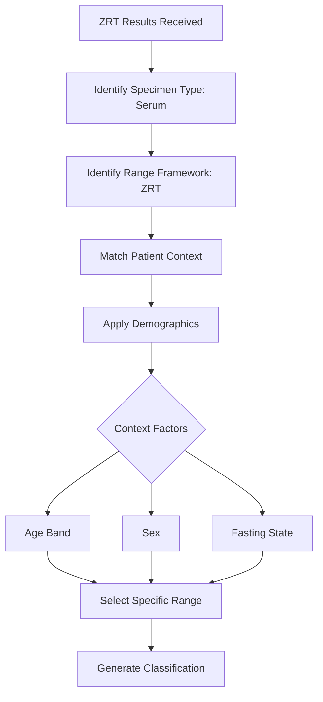

# ZRT Serum Panels
{: .no_toc }

Standard serum chemistry and hormone testing from ZRT Laboratory.
{: .fs-6 .fw-300 }

---

## Table of Contents
{: .no_toc .text-delta }

1. TOC
{:toc}

---

## What Are ZRT Serum Panels?

ZRT Laboratory offers comprehensive serum testing through standard venipuncture blood draws. These tests measure circulating levels of hormones, metabolic markers, and nutrients in the bloodstream.

Serum testing captures a snapshot of what is circulating at the moment of collection. This differs from urine metabolite testing (like DUTCH), which reflects production and metabolism over time.

---

## What ZRT Serum Measures

### Thyroid Panel

The platform includes comprehensive ZRT thyroid ranges:

| Analyte | Unit | Clinical Use |
|:--------|:-----|:-------------|
| TSH | mIU/L | Pituitary thyroid signaling |
| Free T4 | ng/dL | Available thyroid hormone |
| Free T3 | pg/mL | Active thyroid hormone |
| Reverse T3 | ng/dL | Inactive T3 (stress marker) |
| TPO Antibodies | IU/mL | Autoimmune thyroid marker |
| Thyroglobulin Antibodies | IU/mL | Autoimmune thyroid marker |

### Metabolic Panel

| Analyte | Unit | Clinical Use |
|:--------|:-----|:-------------|
| Glucose | mg/dL | Blood sugar |
| Hemoglobin A1c | % | 3-month glucose average |
| Insulin | μIU/mL | Pancreatic function |
| HOMA-IR | ratio | Insulin resistance marker |

### Lipid Panel

| Analyte | Unit | Clinical Use |
|:--------|:-----|:-------------|
| Total Cholesterol | mg/dL | Overall cholesterol |
| LDL Cholesterol | mg/dL | "Bad" cholesterol |
| HDL Cholesterol | mg/dL | "Good" cholesterol |
| Triglycerides | mg/dL | Fat in blood |
| VLDL | mg/dL | Very low density lipoprotein |

### Hormone Panel

| Analyte | Unit | Clinical Use |
|:--------|:-----|:-------------|
| Testosterone (Total) | ng/dL | Total circulating testosterone |
| Testosterone (Free) | pg/mL | Bioavailable testosterone |
| Estradiol | pg/mL | Primary estrogen |
| Progesterone | ng/mL | Luteal function |
| DHEA-S | μg/dL | Adrenal androgen |
| Cortisol (AM) | μg/dL | Morning cortisol |

### Nutrients and Elements

| Analyte | Unit | Clinical Use |
|:--------|:-----|:-------------|
| Vitamin D (25-OH) | ng/mL | Vitamin D status |
| Vitamin B12 | pg/mL | B12 status |
| Ferritin | ng/mL | Iron storage |
| Iron | μg/dL | Circulating iron |
| Magnesium (RBC) | mg/dL | Intracellular magnesium |
| Zinc | μg/dL | Zinc status |

---

## Serum vs Urine Testing

Understanding when to use each:

| Aspect | Serum (ZRT) | Urine (DUTCH) |
|:-------|:------------|:--------------|
| **Measures** | Circulating levels | Production + metabolism |
| **Timing** | Single moment | Integrated over hours |
| **Best for** | Acute status, monitoring | Metabolic pathway analysis |
| **Cortisol** | Single morning level | Diurnal pattern |
| **Estrogens** | Circulating E2 | E1, E2, E3 + metabolites |

Neither is superior — they answer different clinical questions.

---

## How ZRT Results Are Processed

When ZRT serum results enter the platform:

### Context Factors for ZRT

The platform considers:

- **Biological sex** — Male vs female ranges
- **Age band** — Ranges vary by age group
- **Fasting state** — Glucose, insulin, lipids require fasting
- **Time of collection** — Morning cortisol vs afternoon

---

## Functional vs Conventional Ranges

ZRT provides conventional laboratory reference intervals. The platform also offers functional ranges through Named Range Sets.

**Example: TSH**

| Framework | Low | Optimal | High |
|:----------|:----|:--------|:-----|
| Conventional | < 0.4 | 0.4 - 4.5 | > 4.5 |
| Functional | < 1.0 | 1.0 - 2.5 | > 2.5 |

When your clinic selects a Named Range Set, it determines which framework applies. The platform always preserves both classifications for reference.

---

## Named Range Set Integration

ZRT serum results integrate with the Named Range Set system:

1. **Results arrive with ZRT range framework tag**
2. **Named Range Set provides interpretive context**
3. **Functional ranges overlay ZRT reference intervals**
4. **Both conventional and functional classifications are shown**

This dual-view ensures you always know:
- How the result looks by conventional standards
- How it looks by your clinic's functional philosophy

---

## Key Takeaways

- ZRT serum panels measure circulating levels at time of collection
- Comprehensive coverage of thyroid, metabolic, lipid, and hormone markers
- Results are tagged with ZRT range framework for appropriate reference ranges
- Functional ranges from Named Range Sets overlay conventional ZRT ranges
- The platform shows both conventional and functional classifications

