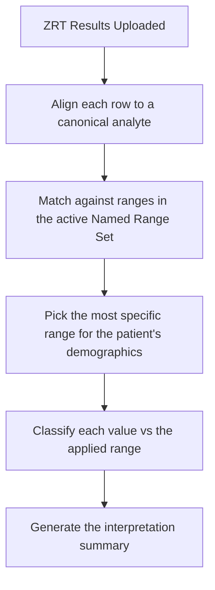

# ZRT Serum Panels
{: .no_toc }

Standard serum chemistry and hormone testing from ZRT Laboratory.
{: .fs-6 .fw-300 }

---

## Table of Contents
{: .no_toc .text-delta }

1. TOC
{:toc}

---

## What Are ZRT Serum Panels?

ZRT Laboratory offers comprehensive serum testing through standard venipuncture blood draws. These tests measure circulating levels of hormones, metabolic markers, and nutrients in the bloodstream.

Serum testing captures a snapshot of what is circulating at the moment of collection. This differs from urine metabolite testing (like DUTCH), which reflects production and metabolism over time.

---

## What ZRT Serum Measures

### Thyroid Panel

ZRT's serum thyroid panel measures:

| Analyte | Unit | Clinical Use |
|:--------|:-----|:-------------|
| TSH | mIU/L | Pituitary thyroid signaling |
| Free T4 | ng/dL | Available thyroid hormone |
| Free T3 | pg/mL | Active thyroid hormone |
| Reverse T3 | ng/dL | Inactive T3 (stress marker) |
| TPO Antibodies | IU/mL | Autoimmune thyroid marker |
| Thyroglobulin Antibodies | IU/mL | Autoimmune thyroid marker |

### Metabolic Panel

| Analyte | Unit | Clinical Use |
|:--------|:-----|:-------------|
| Glucose | mg/dL | Blood sugar |
| Hemoglobin A1c | % | 3-month glucose average |
| Insulin | μIU/mL | Pancreatic function |
| HOMA-IR | ratio | Insulin resistance marker |

### Lipid Panel

| Analyte | Unit | Clinical Use |
|:--------|:-----|:-------------|
| Total Cholesterol | mg/dL | Overall cholesterol |
| LDL Cholesterol | mg/dL | "Bad" cholesterol |
| HDL Cholesterol | mg/dL | "Good" cholesterol |
| Triglycerides | mg/dL | Fat in blood |
| VLDL | mg/dL | Very low density lipoprotein |

### Hormone Panel

| Analyte | Unit | Clinical Use |
|:--------|:-----|:-------------|
| Testosterone (Total) | ng/dL | Total circulating testosterone |
| Testosterone (Free) | pg/mL | Bioavailable testosterone |
| Estradiol | pg/mL | Primary estrogen |
| Progesterone | ng/mL | Luteal function |
| DHEA-S | μg/dL | Adrenal androgen |
| Cortisol (AM) | μg/dL | Morning cortisol |

### Nutrients and Elements

| Analyte | Unit | Clinical Use |
|:--------|:-----|:-------------|
| Vitamin D (25-OH) | ng/mL | Vitamin D status |
| Vitamin B12 | pg/mL | B12 status |
| Ferritin | ng/mL | Iron storage |
| Iron | μg/dL | Circulating iron |
| Magnesium (RBC) | mg/dL | Intracellular magnesium |
| Zinc | μg/dL | Zinc status |

---

## Serum vs Urine Testing

Understanding when to use each:

| Aspect | Serum (ZRT) | Urine (DUTCH) |
|:-------|:------------|:--------------|
| **Measures** | Circulating levels | Production + metabolism |
| **Timing** | Single moment | Integrated over hours |
| **Best for** | Acute status, monitoring | Metabolic pathway analysis |
| **Cortisol** | Single morning level | Diurnal pattern |
| **Estrogens** | Circulating E2 | E1, E2, E3 + metabolites |

Neither is superior — they answer different clinical questions.

---

## How ZRT Results Are Processed

When ZRT serum results enter the platform:

```mermaid
flowchart TD
    A[ZRT Results Uploaded] --> B[Align each row to a canonical analyte]
    B --> C[Match against ranges in the active Named Range Set]
    C --> D[Pick the most specific range for the patient's demographics]
    D --> E[Classify each value vs the applied range]
    E --> F[Generate the interpretation summary]
```

> **How ranges are actually chosen.** HealthPlus does not have a "ZRT range
> framework" that routes results to vendor-specific ranges. Ranges are matched by
> patient **demographics** (sex, age, and — where such ranges are authored —
> pregnancy and menstrual phase) against the clinic's active Named Range Set. Named
> Range Sets express a clinical philosophy, not a lab or methodology: the app
> deliberately rejects naming a set `ZRT`, `DUTCH`, `NutrEval`, or `Genova` ("ZRT is
> a laboratory, not a clinical philosophy") and even rejects specimen words like
> `serum`. Individual range definitions instead carry a stored `specimen_type` and an
> optional `range_framework` tag — descriptive fields, not a matching key.

### Context Factors for ZRT

The platform matches ranges on patient **demographics**:

- **Biological sex** — Male vs female ranges
- **Age** — The most specific applicable age range wins
- **Pregnancy / menstrual phase** — Where such ranges have been authored

Fasting state and time of collection are clinically important for interpreting a
serum result (e.g. glucose/insulin/lipids assume fasting; cortisol assumes a morning
draw), but they are **not** range-matching dimensions in the platform — they are not
used to select which range applies.

---

## Functional vs Conventional Ranges

ZRT provides conventional laboratory reference intervals. The platform also offers functional ranges through Named Range Sets.

**Example: TSH**

> **Illustrative only — not seeded reference values.** The numbers below show the
> *shape* of a conventional-vs-functional comparison; they are not the ranges
> HealthPlus applies. HealthPlus classifies each value against the configured, sourced
> range in your clinic's active Named Range Set — it never invents range boundaries.

| Framework | Low | Optimal | High |
|:----------|:----|:--------|:-----|
| Conventional | < 0.4 | 0.4 - 4.5 | > 4.5 |
| Functional | < 1.0 | 1.0 - 2.5 | > 2.5 |

When your clinic selects a Named Range Set, it determines which functional ranges apply. The platform preserves both the conventional and functional classifications for reference.

---

## Named Range Set Integration

ZRT serum results integrate with the Named Range Set system:

1. **Each uploaded row is aligned to a canonical analyte** — matching is by analyte code, not display name
2. **The active Named Range Set provides interpretive context** — the clinic's chosen clinical philosophy
3. **Ranges are matched by demographics** — the most specific applicable range for the patient's sex/age (and any authored pregnancy/menstrual ranges) wins; there is no "ZRT framework" keying
4. **Both conventional and functional classifications are shown**

This dual-view ensures you always know:
- How the result looks by conventional standards
- How it looks by your clinic's functional philosophy

---

## Key Takeaways

- ZRT serum panels measure circulating levels at time of collection
- Comprehensive coverage of thyroid, metabolic, lipid, and hormone markers
- Uploaded values are matched to ranges by patient demographics against the active Named Range Set — not routed by a vendor "framework"
- Functional interpretation from the active Named Range Set is layered on top of the conventional classification
- The platform shows both conventional and functional classifications

